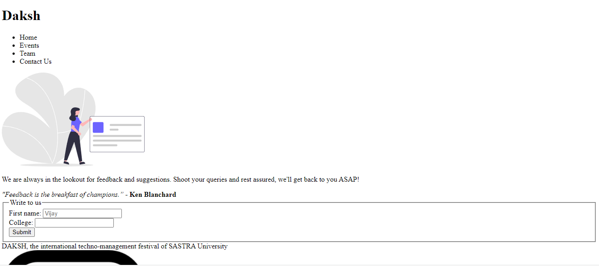
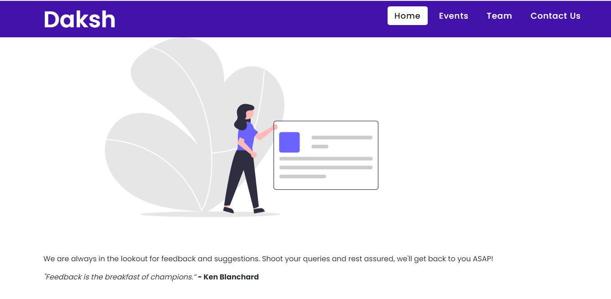
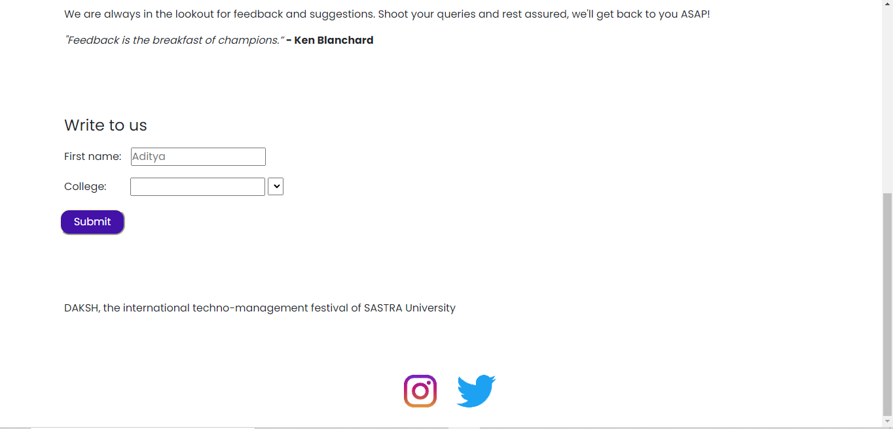
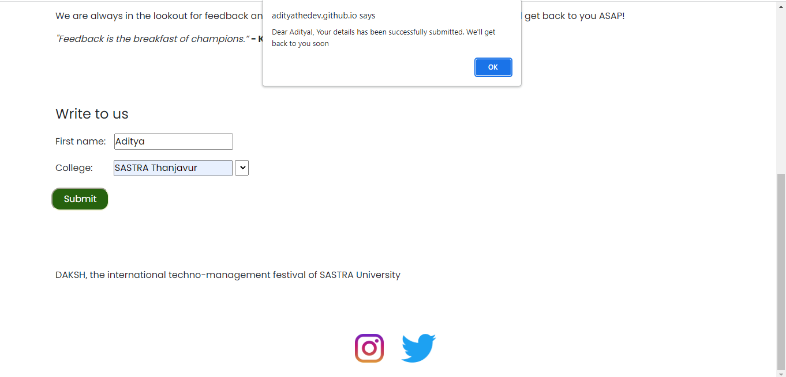

# daksh-recruitment
This is the task assigned by Daksh web team for recruitment. Please use laptop to visit the site for better experience : https://adityathedev.github.io/DakshRecruitmentWebsite/

1.I have created a responsive navbar.

2.Aligned the items neatly.

3.Used javascript to display alert message which makes this website responsive.

4.Color changes when hovering on submit and navabar buttons which makes this website look attractive.

5.The instagram and twitter logo at the bottom takes one to daksh offical social handles.

6.Time taken to build this is 2:30hrs.

7.Click on submit once after entering the name and once without entering the name.

# From This to

# This

# After clicking Submit

